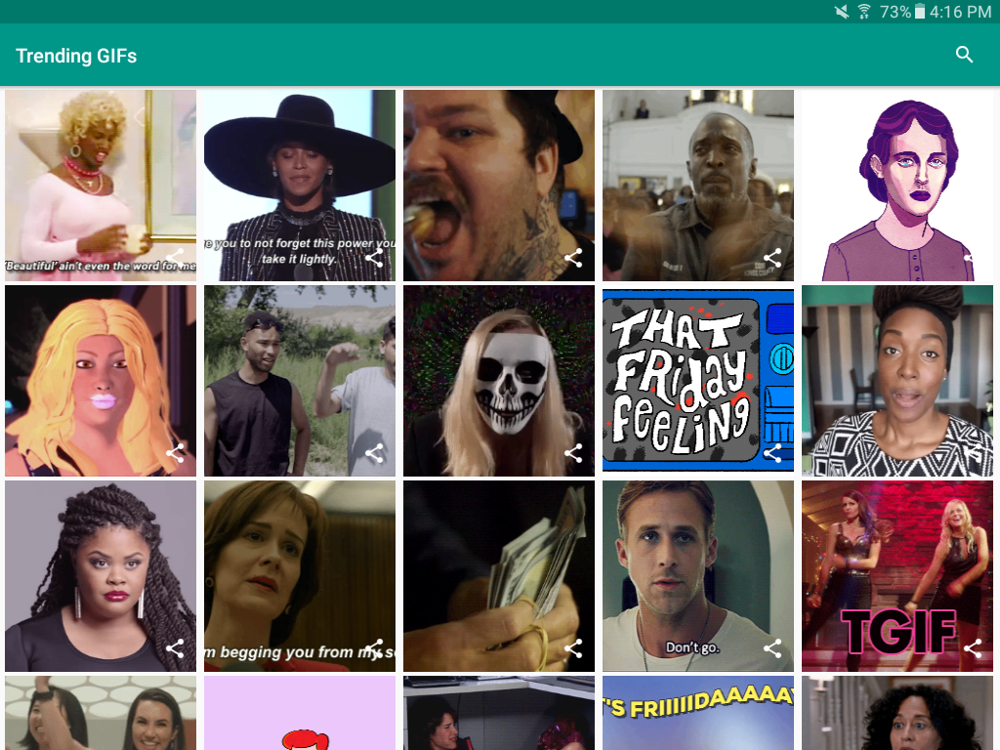

# Giphy Demo



This is just a simple app, used for a workshop I am running.

## Features

This app consumes the GIPHY API and displays a grid of GIFs. You can search for them, and you can download them.

## Compiling

The project is built with gradle, so maintenence and compilation is very straightforward. 

```
$ ./gradlew assembleDebug
```

---

## License

```
Copyright 2016 Luke Klinker

Licensed under the Apache License, Version 2.0 (the "License");
you may not use this file except in compliance with the License.
You may obtain a copy of the License at

http://www.apache.org/licenses/LICENSE-2.0

Unless required by applicable law or agreed to in writing, software
distributed under the License is distributed on an "AS IS" BASIS,
WITHOUT WARRANTIES OR CONDITIONS OF ANY KIND, either express or implied.
See the License for the specific language governing permissions and
limitations under the License.
```
